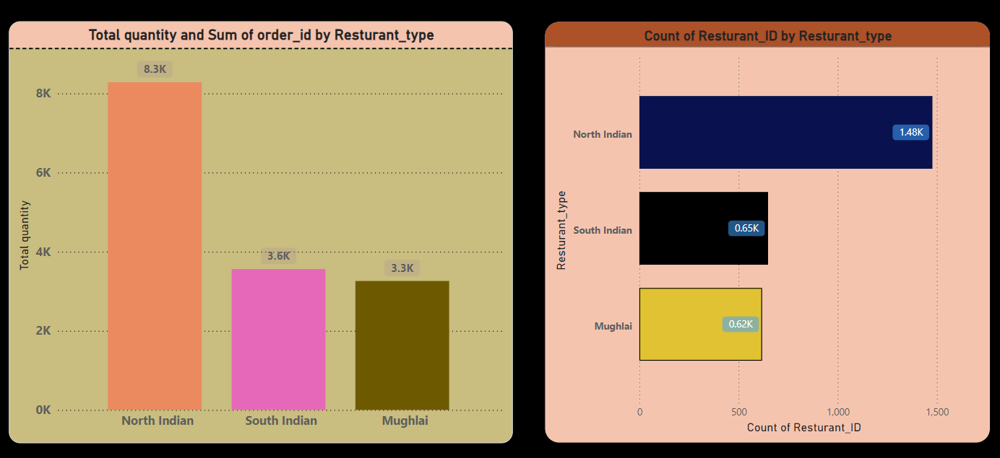

# 30 Days Power BI Challenge 🚀

Welcome to my **30 Days Power BI Challenge**! 🎉 This challenge is an initiative to improve my skills in Power BI, data visualization, and data storytelling by tackling diverse datasets and real-world scenarios. The goal is to create meaningful dashboards, gain insights, and document my learning journey.

## Why This Challenge? 🤔

Power BI is a powerful tool for transforming raw data into actionable insights. This challenge will:
- Enhance my understanding of Power BI features and functionality.
- Strengthen my ability to create insightful and interactive dashboards.
- Build a portfolio of Power BI projects to showcase my skills.
- Encourage consistent learning and growth.

---

## Challenge Structure 📋

### Day 1-10: **Getting Started with Basics**
- Explore the Power BI interface, tools, and features.
- Work on small datasets to build foundational knowledge.
- Focus on data cleaning, transformations, and basic visualizations.

### Day 11-20: **Intermediate Level Projects**
- Analyze datasets from diverse domains like sales, finance, HR, and marketing.
- Create dashboards with KPIs, slicers, and interactivity.
- Experiment with DAX functions for calculated columns and measures.

### Day 21-30: **Advanced and Real-World Scenarios**
- Work on large datasets with complex relationships.
- Design end-to-end solutions from data modeling to storytelling.
- Publish dashboards to Power BI Service and explore sharing options.

---

## Tools and Technologies 🛠️
- **Power BI Desktop**: For creating dashboards and data models.
- **Power Query**: For data cleaning and transformation.
- **DAX (Data Analysis Expressions)**: For advanced calculations.
- **Power BI Service**: For publishing and sharing reports.

---

## Projects Completed So Far ✅
| Day | Dataset | Key Highlights |
|-----|---------|----------------|
| 1   | Sample Sales Data | Built a simple sales dashboard with key KPIs. |

---

---

## How to Use This Repository 📂
Each day's work will be stored in a separate folder, including:
1. **Dataset**: The raw data used for analysis.
2. **Power BI File**: The `.pbix` file containing the dashboard.
3. **Screenshots**: Visual snapshots of the final dashboards.
4. **Documentation**: A short write-up of key insights and learnings.

---

## My Learning Objectives 🎯
1. Master data cleaning and transformation using Power Query.
2. Gain proficiency in creating meaningful visualizations.
3. Understand the use of DAX for calculations and data modeling.
4. Build confidence in presenting and storytelling with data.

---

## Join Me! 🤝
Feel free to explore my progress, provide feedback, or suggest datasets for analysis. Let’s learn and grow together! 💪

---

### Connect with Me 🌟
- [LinkedIn](https://www.linkedin.com/in/lagisetty-ravikiran-a308a3216/)  
- [Portfolio](https://lagisettyravikiran.github.io/Portfolio/)  
- [GitHub](https://github.com/LagisettyRavikiran)  

Thank you for checking out my journey! 🚀
